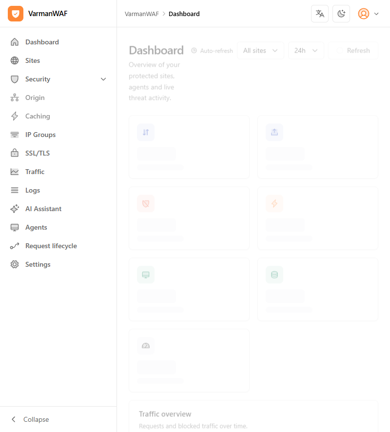
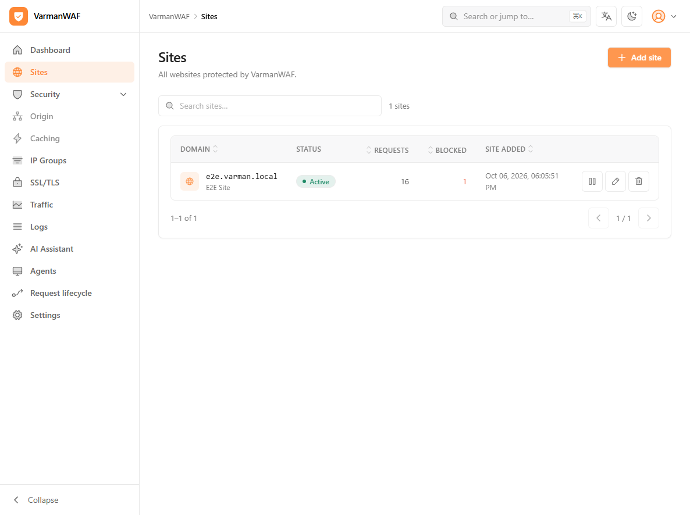
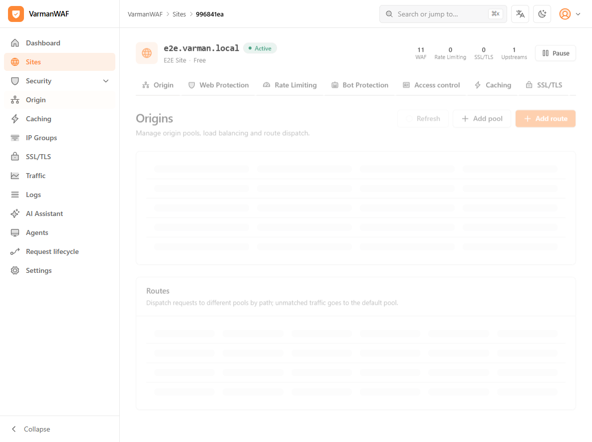
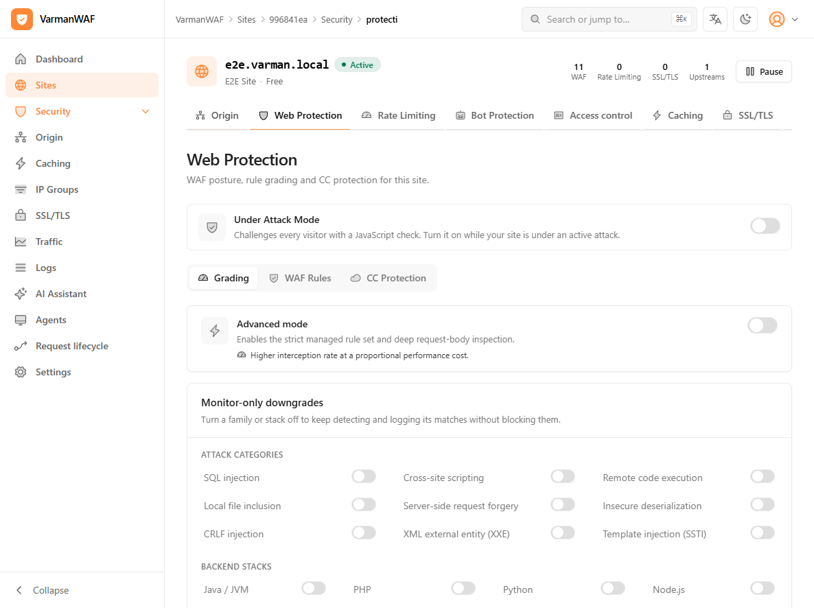
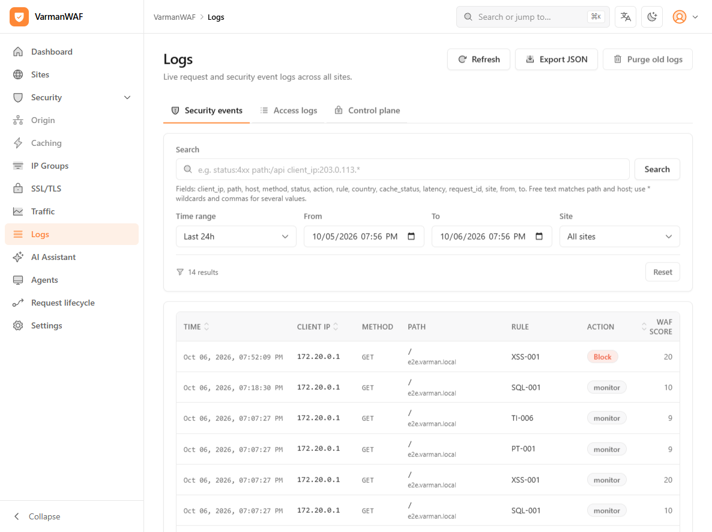
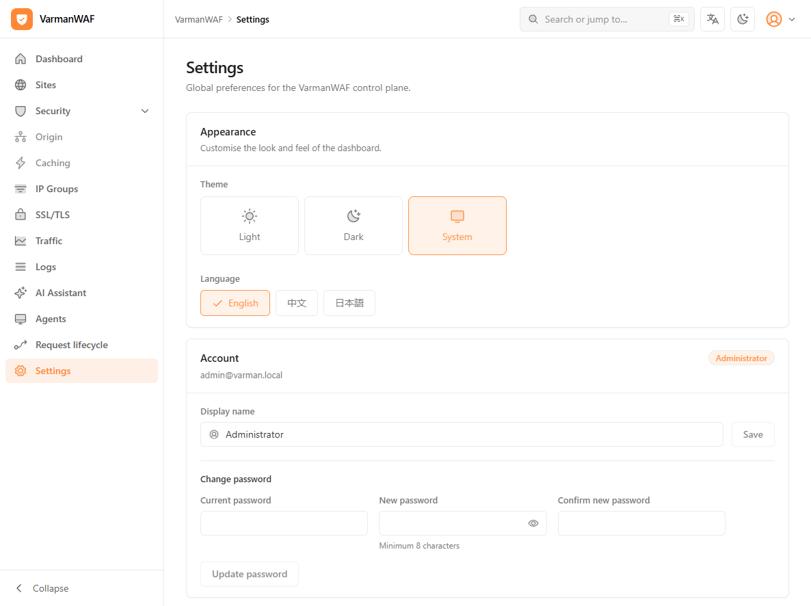

# Using VarmanWAF

A practical guide with screenshots: how to sign in, add a site, tune Web
Protection, read security events and use the REST API. All examples assume the
default all-in-one deployment (`docker compose up -d`).

- Console: `http://localhost:9080` (HTTPS on first boot with a self-signed
  certificate; set `TLS_ENABLED=false` to serve plain HTTP)
- Default credentials: `admin@varman.local` / `varman123` — change them under
  **Settings → Change password** immediately on a real deployment

## 1. Dashboard

The dashboard summarises traffic, blocked requests, cache, WAF activity and
agent health for the selected site and time window.



- **Auto-refresh** can be paused; the window selector switches between 1h/24h/7d.
- **Collapse** hides the sidebar.
- The card row shows requests, blocked requests, cache hit ratio, upstream
  health, WAF detections and agent status.

## 2. Add a site

Open **Sites → Add site** and fill in:

| Field | Example | Notes |
| --- | --- | --- |
| Name | `My site` | Display name |
| Domain | `www.example.com` | The hostname clients use; alternate domains are supported |
| Upstream | `10.0.0.10:8080` | The origin the proxy forwards to |



The first request through the site appears on the dashboard within seconds.

The same operation through the REST API:

```bash
TOKEN=$(curl -s -X POST http://localhost:9080/api/v1/auth/login \
  -H 'Content-Type: application/json' \
  -d '{"email":"admin@varman.local","password":"varman123"}' | jq -r .access_token)

curl -s -X POST http://localhost:9080/api/v1/sites \
  -H "Authorization: Bearer $TOKEN" -H 'Content-Type: application/json' \
  -d '{"name":"My site","domain":"www.example.com","upstream_address":"10.0.0.10:8080"}'
```

> **All-in-one note:** the embedded agent binds to the account's site on
> registration. After creating the **first** site, restart the container once
> (`docker restart varman`) so the data plane picks it up.

## 3. Origin, routes and load balancing

The **Origin** tab of a site manages origin pools and path routes.



- **Add pool** — a group of origin servers with a load-balancing algorithm
  (round robin, consistent hash, least connections, random), optional TLS to
  the origin and a health-check path.
- **Add route** — sends a path prefix/exact/regex match to a pool; unmatched
  traffic goes to the default pool.
- The header shows live counters: WAF actions, rate-limit hits, SSL status and
  upstream count.

## 4. Web Protection

**Sites → your site → Web Protection** is where the WAF posture lives.



- **Under Attack Mode** — challenges every visitor with a JavaScript check.
  Switch it on while a site is under an active flood; switch it off afterwards.
- **Grading tab** — the built-in managed ruleset, graded per attack family
  (SQL injection, cross-site scripting, remote code execution, LFI, SSRF,
  insecure deserialization, CRLF, XXE, SSTI). Each family can be set to
  **block** or **monitor-only**, and rules can be graded individually.
- **WAF Rules tab** — custom rules with match expressions, actions and scores;
  rule changes are pushed to the edge without a restart.
- **CC Protection tab** — challenge configuration (level, clearance duration,
  trigger thresholds, exempt paths).
- **Advanced mode** — the strict managed set plus deep request-body
  inspection; higher interception rate at a proportional performance cost.
- **Monitor-only downgrades** — per attack category and per backend stack
  (Java/PHP/Python/Node.js). A downgraded family keeps detecting and logging
  but never blocks, which is the right setting when a legacy application
  triggers false positives.

The site posture, custom rules and downgrades are also available through the
API (`/api/v1/waf-settings`, `/api/v1/rules`, `/api/v1/sites/{id}`); field
details are in [`docs/api.md`](./api.md).

## 5. Logs and security events

**Logs** shows security events, access logs and control-plane audit logs, with
a search language for filtering.



- **Security events** — WAF detections with rule id, action (`block`,
  `challenge`, `monitor`), score and client IP; the event detail explains which
  detector matched and where.
- **Access logs** — request/response metadata (status, latency, cache status,
  upstream) with truncated body capture where enabled.
- **Control plane** — login and administration activity.
- The search box accepts field filters such as `status:4xx path:/api
  client_ip:203.0.113.*`.

Querying events through the API:

```bash
curl -s "http://localhost:9080/api/v1/logs/security?limit=50" \
  -H "Authorization: Bearer $TOKEN" | jq '.items[0]'
```

## 6. Settings



- **Appearance** — light/dark/system theme. The console is **English only**.
- **Account** — display name and password change.
- Elsewhere under Settings: control-plane HTTPS certificate management, JWT /
  passkey options, retention windows and webhook notifications.

## 7. Agents

**Agents** lists every edge node with hostname, version, public/private IP,
CPU/memory, last heartbeat and the site it serves. In all-in-one mode the
embedded agent appears here; in distributed mode point each agent at the
control plane:

```bash
varman agent --server-url=https://control.example.com:9090 \
  --api-key=$AGENT_API_KEY --cache-dir=/var/lib/varman/cache
```

Agents keep serving from their local cache when the control plane is
unreachable and re-sync automatically afterwards.

## 8. Certificates

**SSL/TLS** (per site and globally) supports:

- uploading a certificate/key pair,
- ACME issuance (HTTP-01 or DNS-01 with provider credentials),
- self-signed certificates for internal sites,
- mTLS client-certificate enforcement with revocation and organization
  pinning.

Certificate status (valid / expiring / expired) is reported from the edge and
visible on the site header.

## 9. Health endpoints

```bash
curl -s http://localhost:9080/healthz          # {"status":"ok", ...}
curl -s http://localhost:9080/api/v1/version   # build + version
```

For deployment, upgrades and troubleshooting see
[`docs/deployment.md`](./deployment.md).
